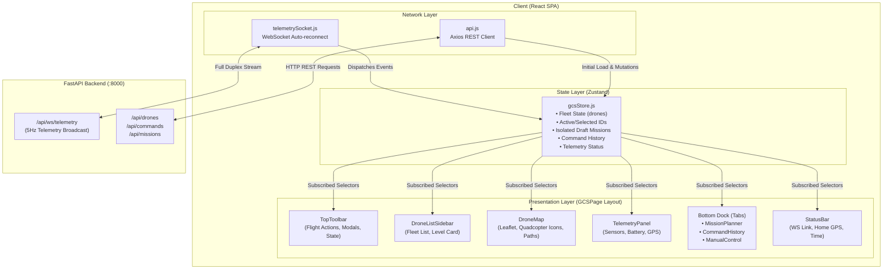

# AetherGCS Frontend UI & Architecture

A technical architecture reference for the **AetherGCS** Ground Control Station frontend — a mission-critical, real-time React application designed for multi-UAV (Unmanned Aerial Vehicle) command, telemetry visualization, and flight planning.

---

## 1. Architectural Overview

AetherGCS frontend operates as a high-density, low-latency Single Page Application (SPA). It provides drone operators with simultaneous multi-drone command capabilities, live telemetry visualization streamed over WebSockets at ~5Hz, interactive geospatial map manipulation via Leaflet, and autonomous mission generation.



---

## 2. Technology Stack

| Layer | Technology | Purpose |
| :--- | :--- | :--- |
| **Framework** | React 19 | Component hierarchy, virtual DOM, and lifecycle hooks |
| **Build & Tooling** | Create React App + CRACO | Webpack build orchestration with `@/*` path alias resolution |
| **State Management** | Zustand (v5) + `zustand/shallow` | Central reactive store with per-drone mission isolation |
| **Styling & Design System** | Tailwind CSS v3 + CSS Variables | Tactical dark-mode design system with military/avionics color accents |
| **UI Primitives** | Radix UI (`@radix-ui/*`) | Accessible, unstyled primitives (Tabs, Dialogs, Dropdowns, Sliders) |
| **Mapping Engine** | Leaflet (v1.9) + React-Leaflet (v5) | Hardware-accelerated map canvas with multi-provider tile layers |
| **Icons & Visuals** | Lucide React | Clean, scalable avionics and UI glyphs |
| **Notifications** | Sonner | Stacked dark-theme toast notifications |
| **Communication** | Native WebSocket + Axios | Real-time telemetry feed and asynchronous REST commands |

---

## 3. Directory Structure

```
frontend/src/
├── App.css                   # Global reset and basic sizing
├── App.js                    # Root router and Sonner toast provider
├── index.css                 # Tailwind directives, CSS variables, and font imports
├── index.js                  # React 19 DOM root mounting
│
├── components/               # Core domain components
│   ├── AddDroneDialog.js     # Modal for registering drones (Serial/SITL)
│   ├── CommandHistory.js     # Real-time tabular log of dispatched MAVLink commands
│   ├── DroneListSidebar.js   # Fleet roster with selection controls & mini HUD
│   ├── DroneMap.js           # Full Leaflet GIS view with drone markers & waypoint paths
│   ├── GcsModal.js           # Reusable modal wrapper styled for tactical HUD aesthetic
│   ├── ManualControl.js      # Velocity-based manual flight control (20Hz loop)
│   ├── MissionLibraryDialog.js # Save/Load/Export/Import mission plans
│   ├── MissionPlanner.js     # Waypoint coordinate table and mission sequencer
│   ├── MissionPlannerHUD.js  # Primary Flight Display (PFD) / Artificial Horizon
│   ├── ResizeHandle.js       # Pointer-captured draggable dividers
│   ├── StatusBar.js          # Bottom link status, coordinates, and UTC/local clock
│   ├── SurveyGridDialog.js   # Photogrammetry lawnmower survey generator
│   ├── TelemetryPanel.js     # Real-time gauges, electrical parameters, and sensor data
│   ├── TopToolbar.js         # Command bar (Arm, Disarm, Takeoff, Land, RTL, Grid)
│   ├── VirtualJoystick.js    # Dual touch/mouse joystick for velocity steering
│   └── ui/                   # Reusable Radix UI wrappers (dialog, tabs, input, etc.)
│
├── hooks/                    # Custom React hooks
│   ├── useResizable.js       # Layout resizing with pointer capture & localStorage
│   ├── useUserGeolocation.js # Browser GPS tracking for Ground Station location
│   └── use-toast.js          # Radix UI toast helper hook
│
├── services/                 # External communication layers
│   ├── api.js                # Axios client definitions for Drones, Commands, Missions
│   └── telemetrySocket.js    # Persistent WebSocket client with exponential backoff
│
├── store/
│   └── gcsStore.js           # Zustand central store & custom selectors
│
└── utils/
    └── format.js             # Numeric, coordinate, duration, and status formatting
```

---

## 4. Layout Architecture (`GCSPage.js`)

The main interface is structured as a full-viewport, 3-column + docked panel layout with dynamic, persistent resizability.

```
+-----------------------------------------------------------------------------------+
| TopToolbar: Flight state, Action buttons (Arm, Takeoff, Land, RTL), Modals        |
+-------------------+---+-----------------------------------+---+-------------------+
| DroneListSidebar  | R | Center Panel                      | R | TelemetryPanel    |
| - Fleet Drones    | E | +-------------------------------+ | E | - Selected Drone  |
| - Selection Box   | S | | DroneMap (Leaflet Canvas)     | | S | - Altitude/Speed  |
| - Level Card/HUD  | I | | - Google/OSM Satellite layers | | I | - Battery % & V/A |
|                   | Z | | - UAV Marker Icons (Heading)  | | Z | - GPS Fix & Sats  |
|                   | E | | - Waypoint Polylines          | | E | - Attitude Gauges |
|                   |   | +-------------------------------+ |   |                   |
|                   | H | | RESIZE HANDLE (Horizontal)    | | H |                   |
|                   | A | +-------------------------------+ | A |                   |
|                   | N | | Bottom Dock (Tabs)            | | N |                   |
|                   | D | | - Mission Planner Table       | | D |                   |
|                   | L | | - Command Log History         | | L |                   |
|                   | E | | - Manual Control (Joysticks)  | | E |                   |
|                   |   | +-------------------------------+ |   |                   |
+-------------------+---+-----------------------------------+---+-------------------+
| StatusBar: WebSocket link health, Home/User GPS coordinates, System time          |
+-----------------------------------------------------------------------------------+
```

### Flexible Panel Sizing (`useResizable.js`)
- Panel dimensions are stored in `localStorage` under `aether-gcs-layout`.
- Supports pointer capture (`setPointerCapture`) for smooth dragging across iframes and canvas boundaries.
- Uses `requestAnimationFrame` for stutter-free 60fps resizes.
- Double-clicking a resize handle resets the panel to its default size.

---

## 5. State Management (`gcsStore.js`)

AetherGCS uses **Zustand** as its single source of truth. State updates occur upon incoming WebSocket messages (~5Hz) or operator interactions.

### 5.1 Core State Schema

```javascript
{
  drones: { [droneId: string]: DroneObject },
  selectedDroneIds: string[],     // Multi-selection for swarm operations
  activeDroneId: string | null,   // Single drone focused in Telemetry and HUD
  wsStatus: "connecting" | "open" | "closed",
  commandHistory: CommandLog[],   // Last 300 executed commands
  
  // Per-Drone Draft Mission Isolation
  draftMissions: {
    [targetKey: string]: {
      name: string,
      default_altitude: number,
      default_speed: number,
      waypoints: Waypoint[]
    }
  },
  draftMission: CurrentTargetMission,
  
  missions: SavedMission[],       // Mission library from database
  userLocation: { lat: number, lon: number } | null
}
```

### 5.2 Per-Drone Mission Isolation Pattern
To prevent cross-contamination when switching between drones:
1. `_getTargetKey(state)` identifies the target context:
   - If multiple drones are selected: returns `"swarm"`.
   - If a single drone is selected: returns that drone's `id`.
   - Otherwise: returns `activeDroneId` or `"default"`.
2. When the user modifies waypoints (e.g., `addWaypoint`, `updateWaypoint`, `removeWaypoint`), edits are saved to `draftMissions[key]`.
3. Selecting a different drone automatically surfaces that drone's isolated draft mission without losing unsaved changes.

### 5.3 High-Performance Selectors
To prevent re-rendering the entire page on every 5Hz telemetry tick:
- `useDroneList()`: Uses `useShallow` to re-render only when drone IDs or object identities change.
- `useSelectedDrones()`: Returns an array of selected drone objects via `useShallow`.
- `useActiveDrone()`: Extracts only the active drone object for the HUD and Telemetry panels.

---

## 6. Real-Time Telemetry & Communication Flow

### 6.1 WebSocket Stream (`telemetrySocket.js`)
A persistent WebSocket connection is maintained with the backend at `/api/ws/telemetry`.
- **Auto-Reconnect**: Implements exponential backoff (starting at 1s up to a 10s ceiling).
- **Keep-Alive**: Sends a `"ping"` heartbeat every 15 seconds to prevent NAT/proxy timeouts.
- **Event Handling**:
  - `snapshot`: Replaces complete drone state on initial handshake.
  - `drone`: Updates or inserts telemetry for a specific UAV.
  - `drone_removed`: Purges a decommissioned UAV from the store.
  - `command`: Appends a newly executed command log with status (`sent`, `ack`, `success`, `failed`).

### 6.2 Dual-Mode Command Dispatching
1. **Discrete Commands** (REST via `commandsApi.send`):
   - Arm, Disarm, Takeoff, Land, Return-to-Launch (RTL), Upload Mission, Start Mission.
   - Dispatches an asynchronous HTTP POST request to `/api/commands`.
2. **Continuous Velocity Streaming** (REST in 20Hz loop via `ManualControl.js`):
   - When using virtual joysticks, a 50ms interval continuously dispatches velocity setpoints (`forward`, `right`, `up`, `yaw_rate`) directly to selected drone IDs.

---

## 7. Key UI Components & Avionics Features

### 7.1 Leaflet Map Engine (`DroneMap.js`)
- **Map Providers**: Selectable on-the-fly between Google Satellite, Google Hybrid, CartoDB Dark, and OpenStreetMap.
- **Custom Quadcopter Icon**: Rendered dynamically using an SVG `L.divIcon` displaying:
  - Heading rotation (`transform: rotate(N deg)`)
  - Status rotor colors (Green = Armed, Red = Disarmed)
  - Accent stroke (Amber = Selected, Cyan = Normal)
- **Flight Vectors & Waypoints**:
  - Polyline connecting waypoints in sequential flight order.
  - Live breadcrumb trails representing past UAV positions.
  - Interactive map clicking to drop new waypoints directly into the active mission.

### 7.2 Primary Flight Display / HUD (`MissionPlannerHUD.js`)
An authentic military-style Primary Flight Display (PFD):
- **Artificial Horizon**: Dynamically transforms with Pitch ladder (-90° to +90°) and Roll tilt rotation.
- **Airspeed & Altitude Tapes**: Vertical scrolling numerical tapes.
- **Compass Tape**: Horizontal 360° heading tape with cardinal markings (N, NE, E, SE, S, SW, W, NW).
- **Horizon Calibration**: One-click level horizon calibration trigger sent to flight controller.

### 7.3 Photogrammetry Survey Grid Generator (`SurveyGridDialog.js`)
Generates automated aerial survey lawnmower patterns:
- Centers on the active drone's home/current coordinates.
- Projects flight grid dimensions (length, width, lane spacing, rotation angle) using local latitude spherical trigonometry:
  $$\Delta \text{lat} = \frac{y}{111139}, \quad \Delta \text{lon} = \frac{x}{111139 \cdot \cos(\text{lat} \cdot \frac{\pi}{180})}$$
- Automatically injects Takeoff and sequential Waypoint actions directly into the Mission Planner draft.

### 7.4 Telemetry Gauges (`TelemetryPanel.js`)
- **Electrical Metrics**: Live battery percentage with dynamic warning thresholds (Green > 40%, Amber 20–40%, Orange/Red < 20%), pack voltage, and current draw.
- **Kinematics**: Relative altitude, Mean Sea Level (MSL) altitude, groundspeed, and vertical climb rate.
- **Navigation**: GPS Fix indicator (3D Fix, DGPS, RTK), satellite count, and latitude/longitude to 7 decimal places.

---

## 8. Design System & Styling Guidelines

### 8.1 Tactical Color Palette

| Token | Hex | Usage |
| :--- | :--- | :--- |
| `gcs-bg` | `#09090b` | Main application backdrop (Zinc 950) |
| `gcs-surface` | `#18181b` | Panels, toolbars, sidebar backgrounds |
| `gcs-amber` | `#FFB000` | Active selection, primary highlights, warning alerts |
| `gcs-cyan` | `#00F0FF` | Information, secondary accents, link metrics |
| `gcs-connected` | `#00FF41` | Armed status, valid telemetry, nominal system health |
| `gcs-disconnected` | `#FF003C` | Disarmed status, errors, emergency stop action |
| `gcs-lowbat` | `#FF5500` | Critical battery warnings and alerts |

### 8.2 Typography
- **UI & Controls**: `IBM Plex Sans` (clean, readable human factors typography)
- **Telemetry & Numerical Data**: `JetBrains Mono` with `tabular-nums` (prevents jittering during rapid numeric updates)
- **Headers & Labels**: `Chivo` (bold, military-grade display font)

---

## 9. Build, Configuration & Testing

### Environment Variables
Configured in `frontend/.env`:
```env
REACT_APP_BACKEND_URL=http://localhost:8000
```

### Scripts
- `npm start` / `yarn start`: Runs CRACO development server at `http://localhost:3000`.
- `npm run build` / `yarn build`: Compiles optimized production bundle into `frontend/build/`.
- `npm test` / `yarn test`: Launches Jest test runner with React Testing Library.

### Quality & Testing Attributes
All interactive controls, inputs, buttons, and telemetry cells feature explicit `data-testid` attributes (e.g., `btn-arm`, `btn-takeoff`, `telemetry-panel`, `drone-row-<id>`), enabling automated End-to-End testing via Playwright or Cypress.
